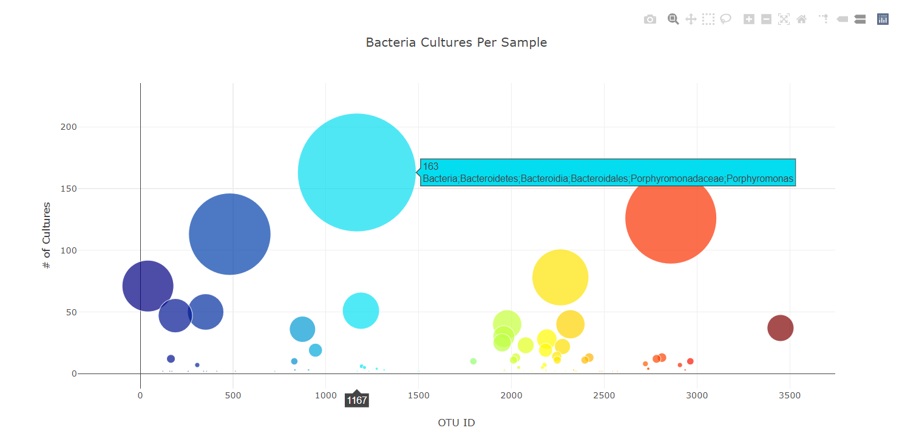

# Belly-Button-Biodiversity Dashboard 

## Purpose of Project
Using JavaScript, Plotly, and D3.js, I created a dashboard that displays bacterial data based an individual’s ID which is selected from the dropdown menu on the webpage. In this project, I demonstrated my proficiency to: use JavaScript functions and methods: map(), filter(), reverse(), and slice(), load a JSON file with d3.json(), create a function that reads in json data, and write code to use the ID number to create the sample’s information on a panel and charts. 

## Background of Project
Improbable Beef, a fictional food startup, has had success in synthesizing meat from algae, fungi, and microorganisms; however, they are searching for the elusive bacteria that will provide the perfect taste. Roza, a biological researcher, hypothesizes that the bacterial species that have the ability to synthesize proteins that taste like beef might be found in the belly button. She has collected naval bacteria from participants across the country. Each participant is assigned a "Test Subject ID Number" that can be entered in the drown menu on the dashboard. 

---
## The Charts
### Horiztonal Bar Chart 
The bar chart displays the top 10 bacterial species in a participant's naval. Each bacteria can be identified by the OTU ID number on the left hand side or hovering over the bar will display its scientific name. 

### Gauge Chart 
The gauge chart displays the number of times each week the participant washed their naval on a scale of 0-10.

### Bubble Chart 
The bubble chart displays the number of cultures for each bacteria in the participant's naval. Bacteria with a larger number of cultures has a larger marker (i.e. more cultures = bigger marker). Each bacteria can be identified by hovering over the marker. 

